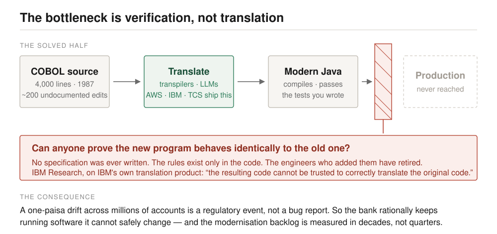
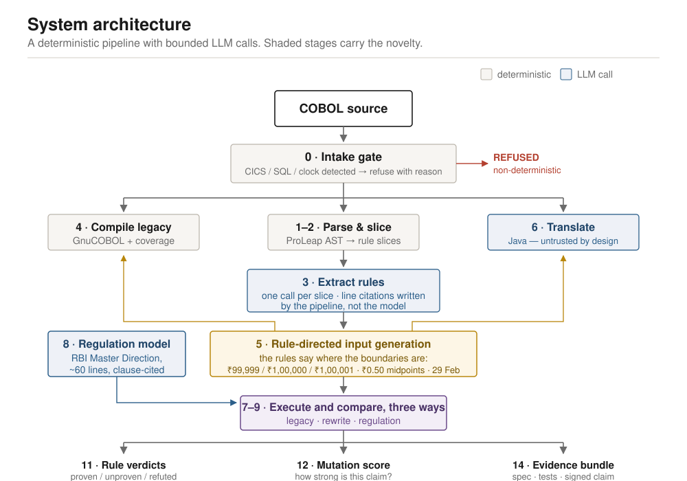
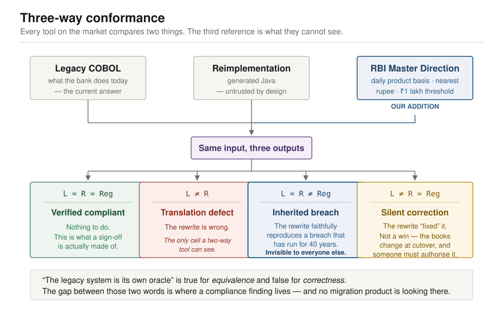
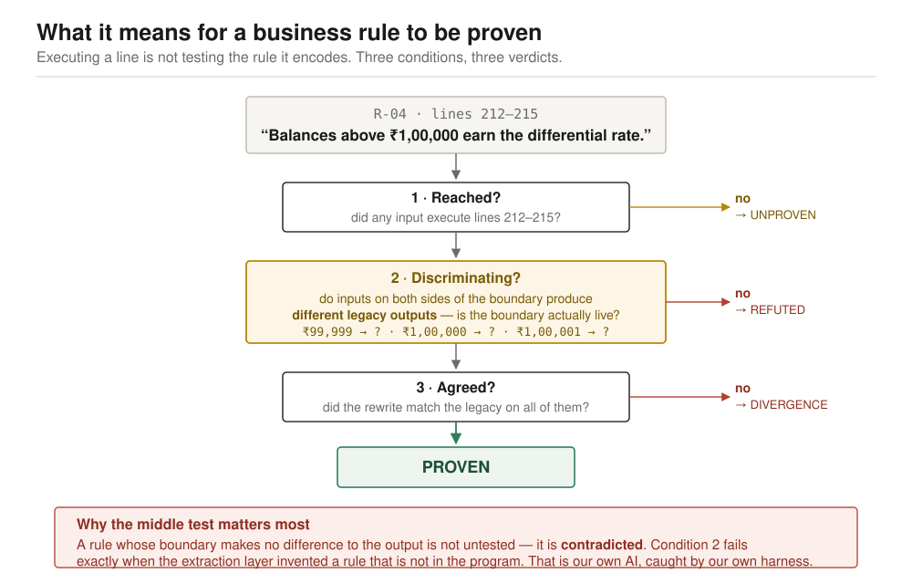
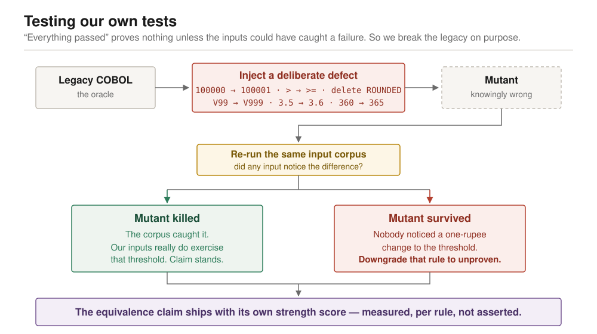
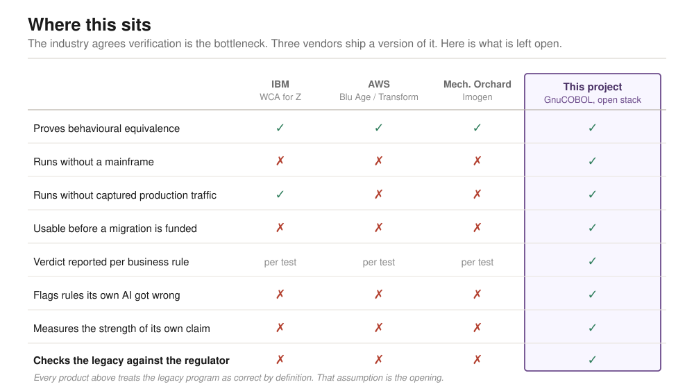
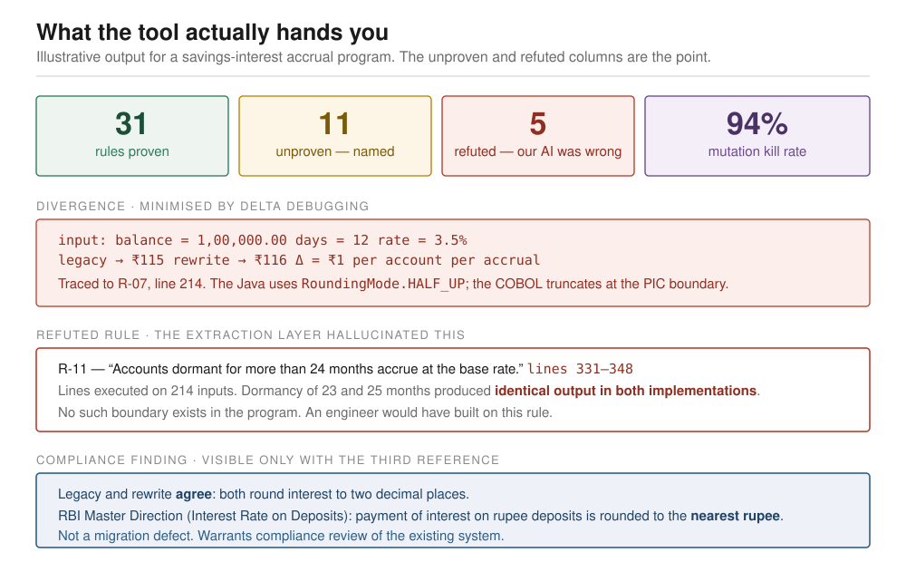
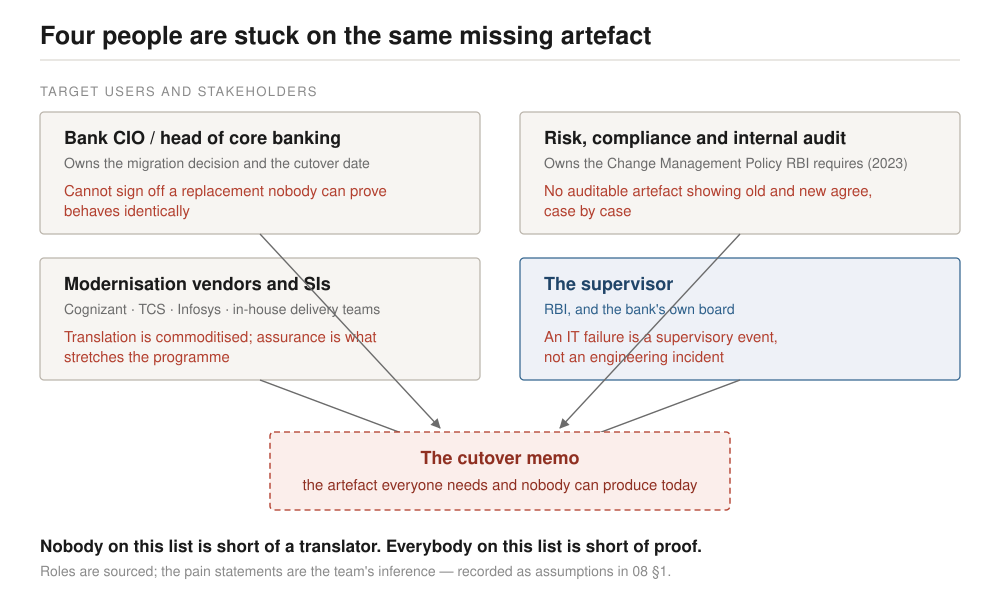
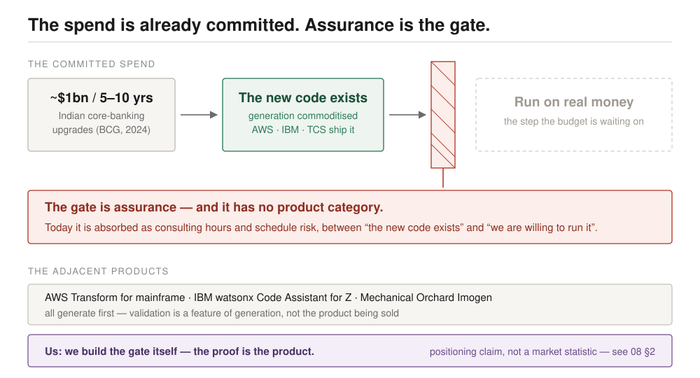
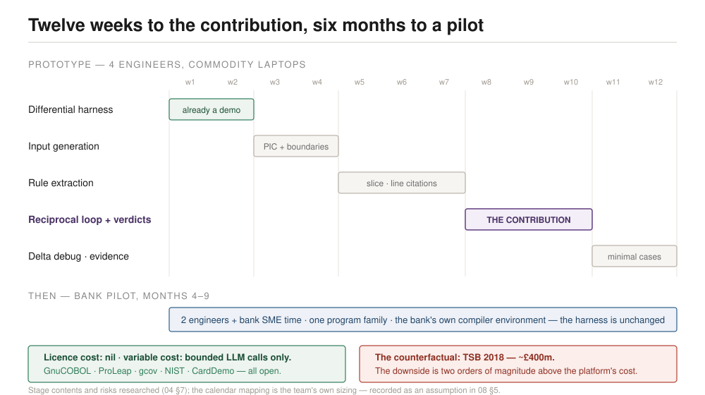

# Visuals

Ten diagrams explaining the problem, the system and the novelty. Plain SVG —
no dependencies, scales to any size, opens in any browser, and drops straight
into the deck. Diagrams 8–10 were added for round 2 and cover the CII
business-plan material.

British spelling and the same palette throughout: green = proven, amber =
unproven, red = refuted or defective, blue = the regulation, purple = the
system's own reasoning.

---

## 1 · The verification bottleneck

The problem in one frame. Translation is the solved half — transpilers and LLMs
do it, and AWS, IBM and TCS all ship it. The barrier sits between the generated
code and production: nobody can prove the new program behaves like the old one,
because no specification was ever written. Use this as the opening slide.

---

## 2 · System architecture

The full pipeline. Deterministic by design, with LLM calls confined to two
bounded points — justified by the controlled study showing deterministic
orchestration matches agentic accuracy at up to 3.5× lower token cost.

The gold arrows are the reciprocal loop: extracted rules determine which inputs
get generated, and those inputs drive both implementations. Stage 0 refuses
programs the method cannot handle soundly rather than producing a confident
wrong answer.

---

## 3 · Three-way conformance

**The differentiator.** Every tool on the market compares two things and treats
the legacy program as correct by definition. Adding the regulator as a third
reference produces four outcomes instead of one — and the valuable one, where
the legacy and the rewrite agree with each other while both breach the Master
Direction, is structurally invisible to a two-way tool.

The line to deliver with this slide: *"the legacy system is its own oracle" is
true for equivalence and false for correctness.*

---

## 4 · What it means for a rule to be proven

The core technical contribution. Executing a line is not testing the rule it
encodes, so *proven* requires three conditions, not one. The middle condition —
did inputs on both sides of the boundary actually produce different outputs? —
is what catches the extraction layer inventing rules that are not in the
program. When it fails, the verdict is **refuted**, not *unproven*.

---

## 5 · Testing our own tests

The answer to *"everything passed, so what?"* Break the legacy program on
purpose — move a threshold by one rupee, delete a `ROUNDED` — and check whether
the input corpus notices. If it does not, the equivalence claim over that rule
is worth nothing regardless of how many tests passed, and the rule gets
downgraded.

This is the Q&A slide. It rarely gets shown; it always gets asked about.

---

## 6 · Where this sits

The honest competitive picture. The first row is deliberately a row of ticks for
everyone — claiming to have invented differential verification would not survive
a judge who works on mainframe modernisation. The claim is the rows below it.

Keep this in the appendix and bring it out when the "IBM already does this"
question arrives.

---

## 7 · What the tool hands you

Illustrative output, and the shape of the demo. Four numbers, one divergence
minimised to a single line, one refuted rule, one compliance finding.

The refuted rule is the slide that proves the thesis: an AI system catching its
own AI lying, with a reproducible counterexample. The compliance finding is the
slide a banker starts caring about.

---

## 8 · Who is stuck — the stakeholder map

Round-2 addition. Four stakeholders converge on the one artefact none of them
can produce: the cutover memo. The supervisor's card is blue because the
regulator is the reference, not a user. Pain statements are the team's
inference, recorded as assumptions in `08 §1` — the caption says so on the
diagram itself.

---

## 9 · The assurance gate

Round-2 addition; the market-potential argument in one frame, deliberately
echoing diagram 1's barrier motif. The committed spend flows through generation
(solved, green) and stops at the assurance gate (red). The bottom strips carry
the competitive claim honestly: the adjacent products all generate first, and
"the proof is the product" is labelled a positioning claim, not a market
statistic.

---

## 10 · Build timeline and the business case

Round-2 addition. The twelve-week prototype plan as a bar schedule — weeks 8–10
in purple because the reciprocal loop and per-rule verdicts are the
contribution — then the bank pilot in blue (months 4–9, the bank's own compiler
environment). The two footer cards compress investments (licence cost nil) and
the counterfactual (TSB, ~£400m). The calendar mapping is team sizing, flagged
as an assumption on the diagram.

---

## Using these

- **Editing:** plain text. Change a label by editing the `<text>` element.
- **In the deck:** PowerPoint imports SVG directly (Insert → Pictures). Right-
  click → Convert to Shape if individual elements need recolouring.
- **In the PDF:** `build-pdf.py` in the parent folder inlines all ten.
- **Sizing:** each has a `viewBox`, so scaling is lossless at any size.
