# The Round-2 Deck

The thirteen slides of `StudyEdge_Banking and Finance Technology_V2.pptx` as
submitted for round 2, rendered to PNG through PowerPoint itself — so these
are the slides exactly as an evaluator's machine will draw them.

Slides 4, 7, 9, 11 and 12 are the round-2 additions mandated by the CII
template (stakeholders, technical details, market potential, and the two
business-plan pages). Every figure on them traces to `01`–`08`; the two
business-plan pages carry the template's WHY / HOW / WHAT and
Investments / Returns / Timelines structure.

---

## 1 · Title

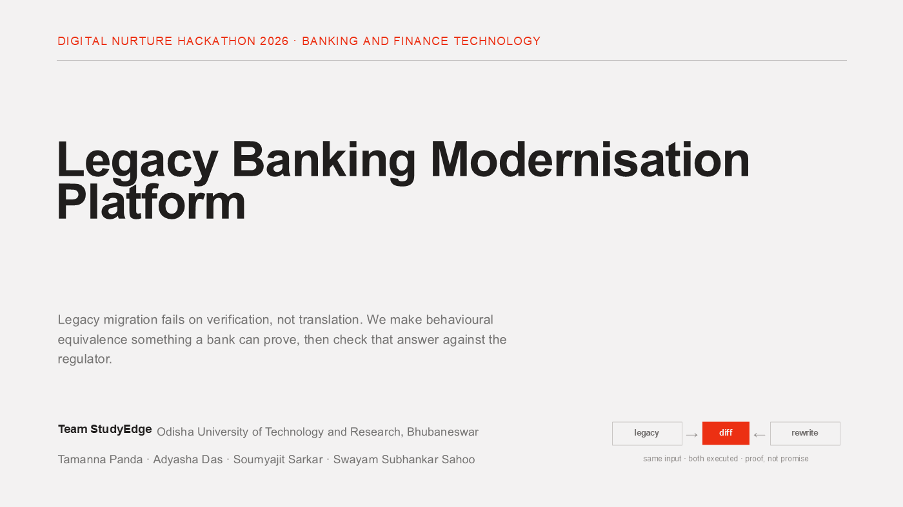

## 2 · Problem

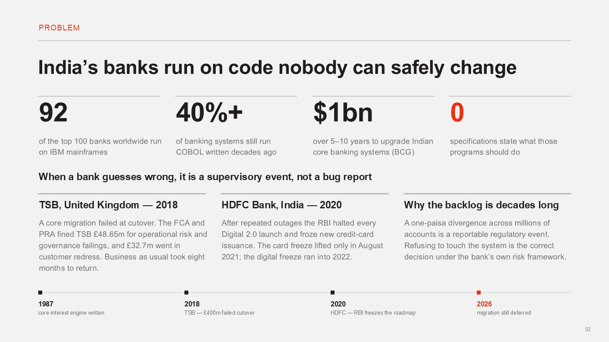

## 3 · Why it's unsolved

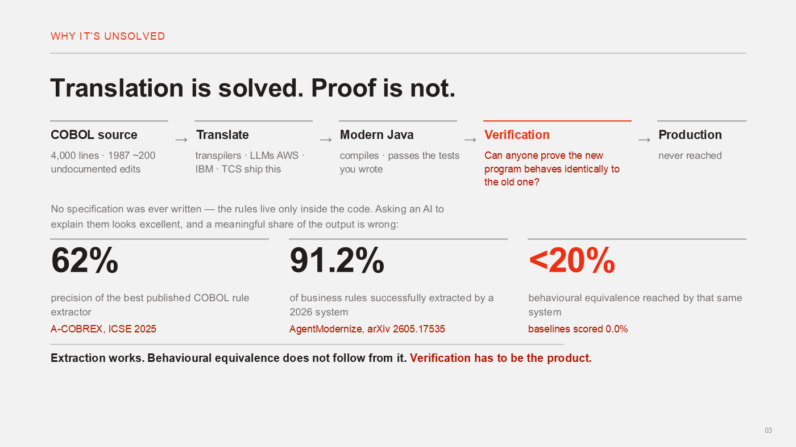

## 4 · Target users &amp; stakeholders — round-2 addition

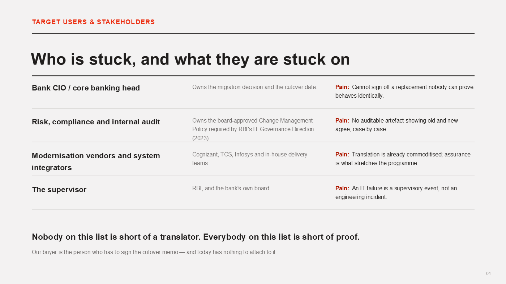

## 5 · Our solution

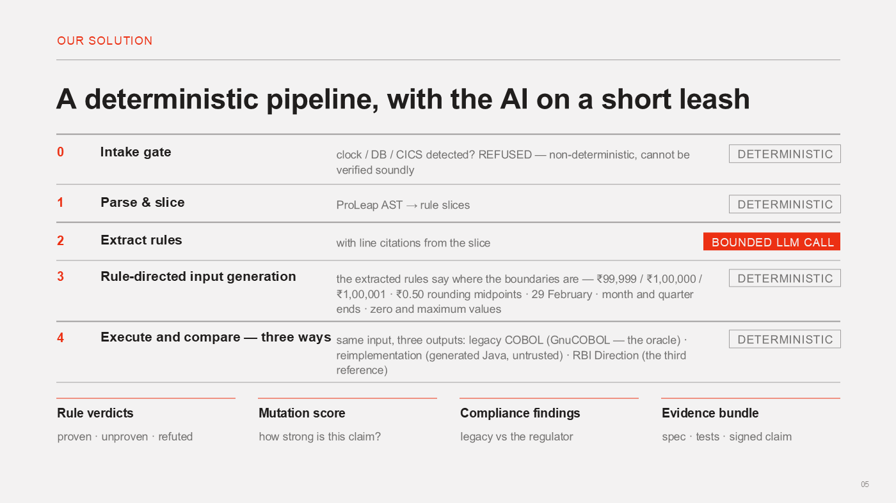

## 6 · How it works

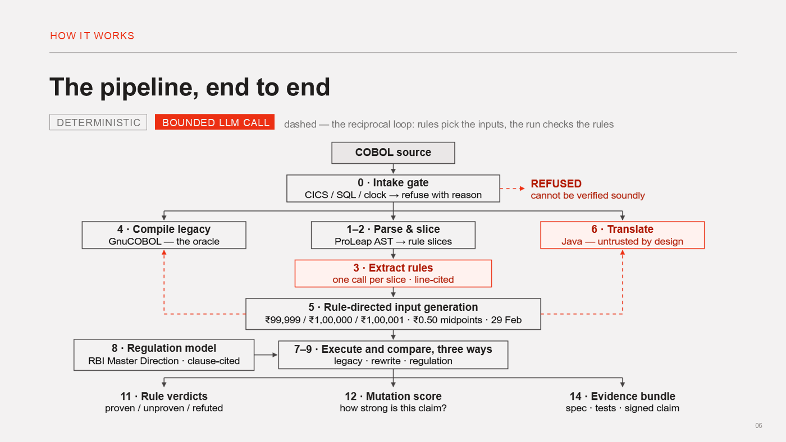

## 7 · Technical details — round-2 addition

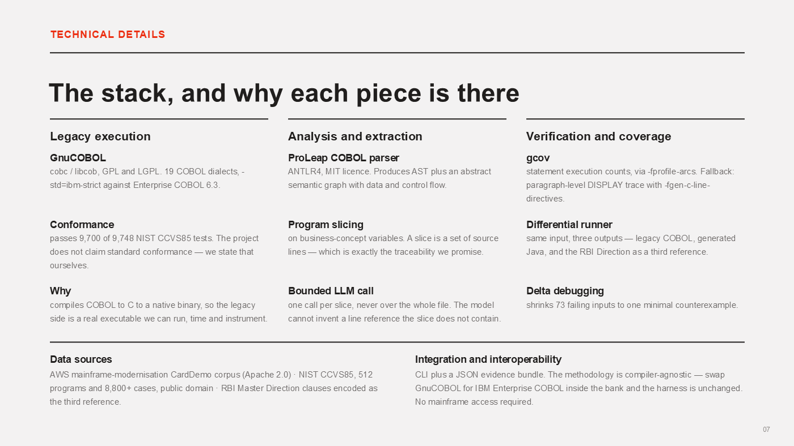

## 8 · What makes it different

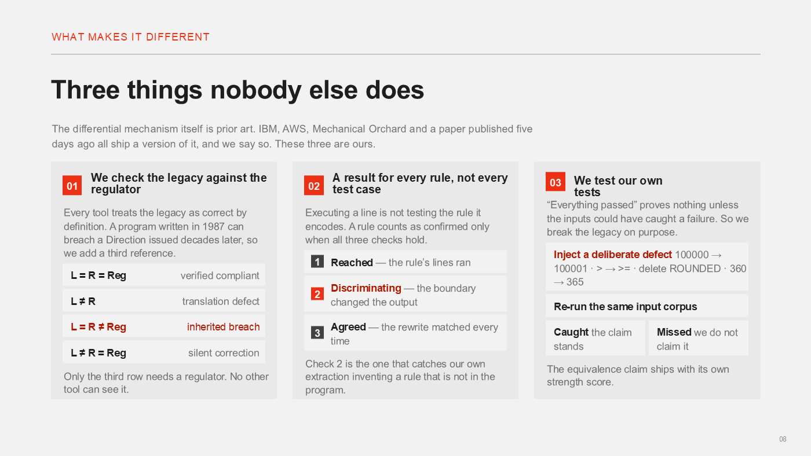

## 9 · Market potential — round-2 addition

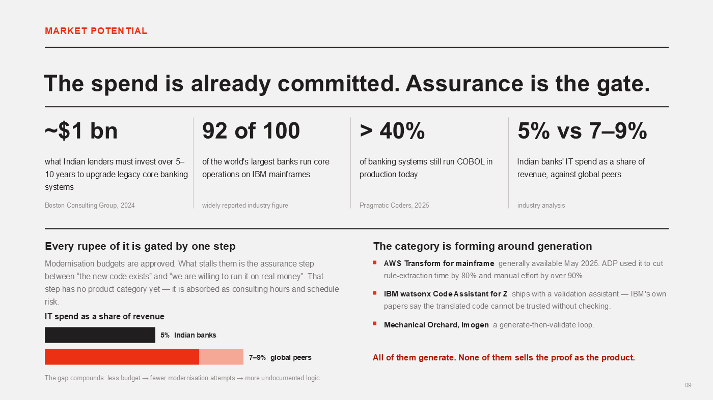

## 10 · Feasibility &amp; scope

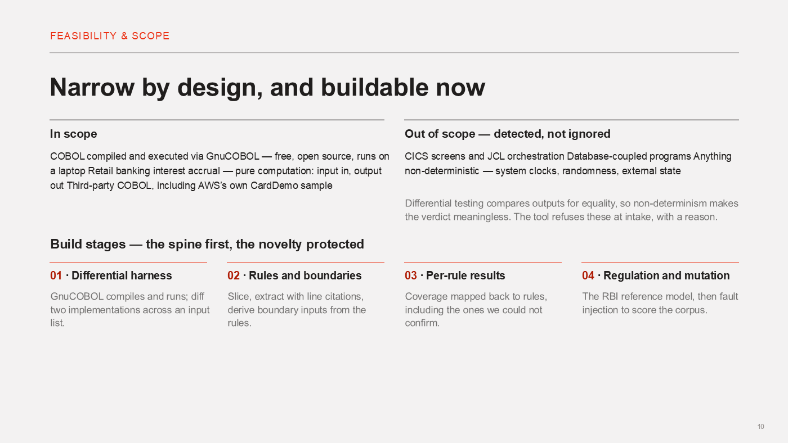

## 11 · Business plan (1/2) — round-2 addition

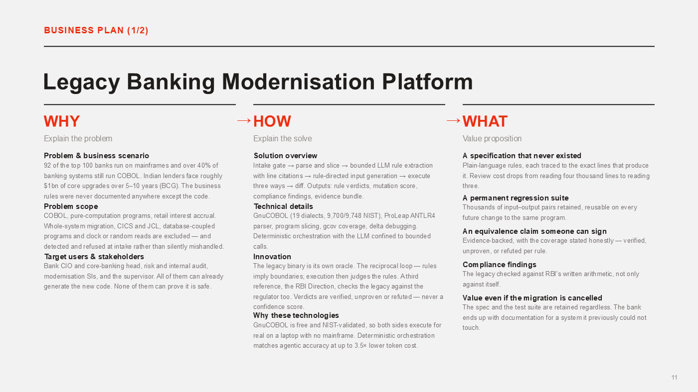

## 12 · Business plan (2/2) — round-2 addition

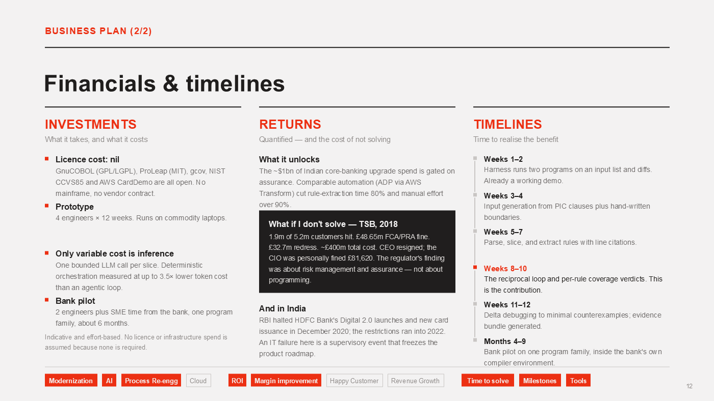

## 13 · References

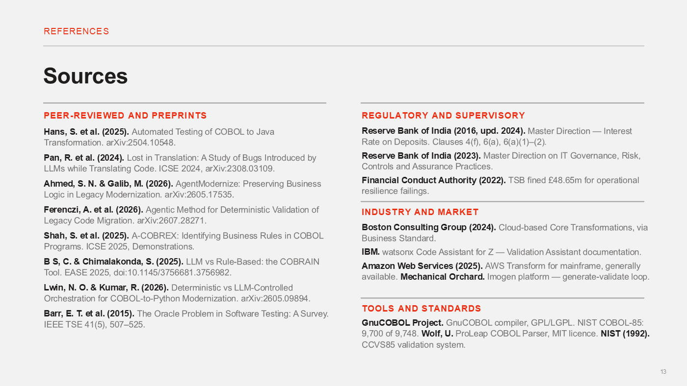
